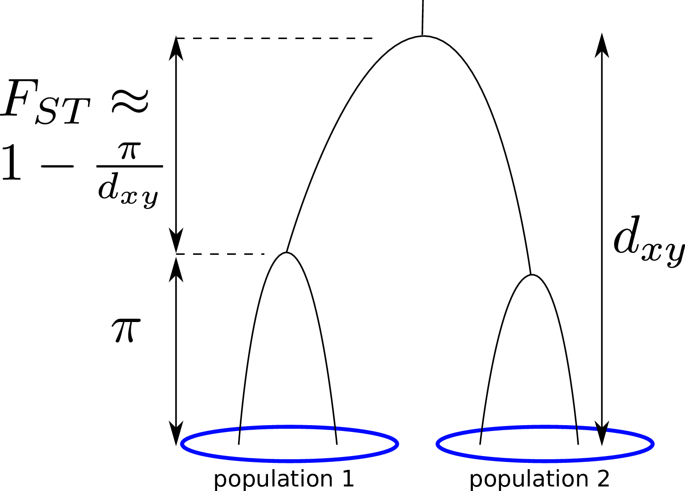
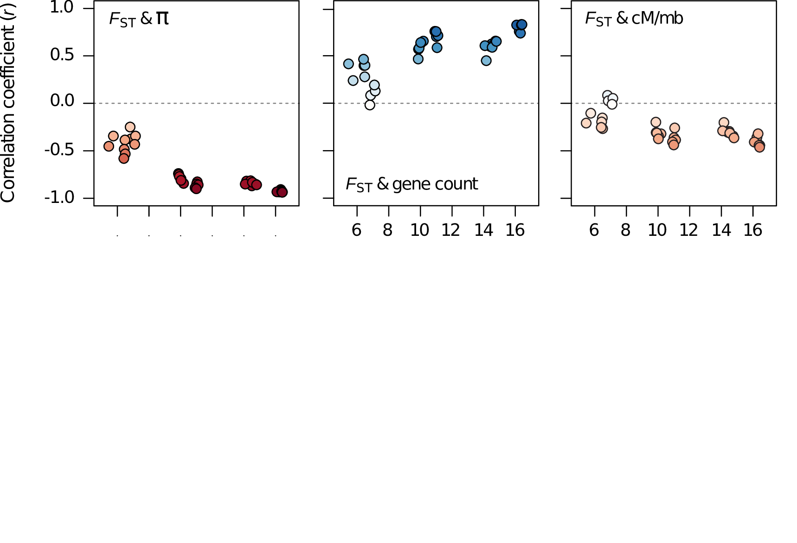
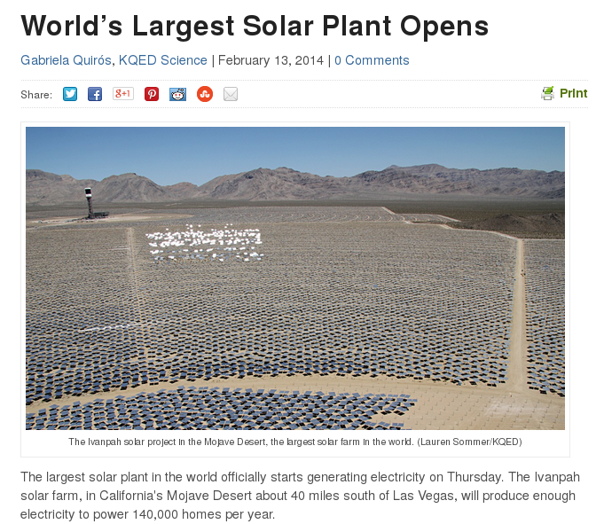

# Overview

##

1. Two problems, about geography and evolution

2. The challenge: better simulations

3. Genomic landscapes, across time

4. Some steps forward for spatial population genetics

# Problem #1

## Genomic landscapes

##

What causes variation in genetic diversity?

##

$$
\begin{aligned}
\pi &= \text{ (within-pop diversity) } \\
d_{xy} &= \text{ (between-pop divergence) } \\
F_{ST} &= \text{ (relative differentiation) }
\end{aligned}
$$

::: {.centered}

{width=60%}

:::

## Diversity correlates with recombination rate

Corbett-Detig et al 2015; Cutter & Payseur 2013 

--------------------

{width=70%}

Corbett-Detig et al 2015

-------------------

<!--
-------------------

McVicker et al 2009
-->

The *Mimulus aurantiacus* species complex
-----------------------------------------

::: {.centered}

:::

------------------

::: {.centered}
{width=70%}
:::

----------------------------------

----------------------------------

-------------------------

The data:

- chromosome-level genome assembly
- $20\times$ coverage of 8 taxa and outgroup (*M.clevelandii*)
- diversity ($\pi$), divergence ($d_{xy}$),
    and differentiation ($F_{ST}$) in windows
- 36 pairwise comparisons among 9 taxa
- estimates of recombination rate and gene density
    from map and annotation

<!--
## A spectrum of differentiation

-->

-------------------

---------------------

---------------------

---------------------

## Questions

selection? how much? what kind? other options?

## Conclusions

- Emergence of landscape of diversity across $\approx$ 1.5 million years!

- Shared targets of linked selection across taxa?

. . .

- But, what *kind* of linked selection? \
    How strongly and frequently does it act? \
    On how many targets?

. . .

Consequences for: genetic load/disease,
speed of evolution,
trait architecture.

<!-- Tortoise intro -->

# Problem #2

## the Mojave Desert Tortoise

  *Gopherus agassizii:*
  

## the Mojave Desert Tortoise

  

## the Mojave Desert Tortoise

  

## the Mojave Desert Tortoise

  

## The question(s)

::: {.columns}
::::::: {.column width="50%"}

1. How will changes to the landscape affect population viability and gene flow?

2. How do tortoises move around on the landscape?

:::
::::::: {.column width="50%"}

:::
:::::::

<!-- section SIMULATION -->

# Simulation: not as easy as you might think

-----------------------------------------

------------------

{width=70%}

-----------------------------

To check predictions, we need simulations with:

- many loci under selection
- geographic population structure
- large populations with long genomes

for long enough to reach equilibrium ($\sim 10N$ generations).

. . .

For instance: $10^4$ individuals with $2 \times 10^8$ base pairs each for $10^5$ generations;
nonneutral mutations possible at $10^5$ loci.

##

*First:*

- **large populations with long genomes**

