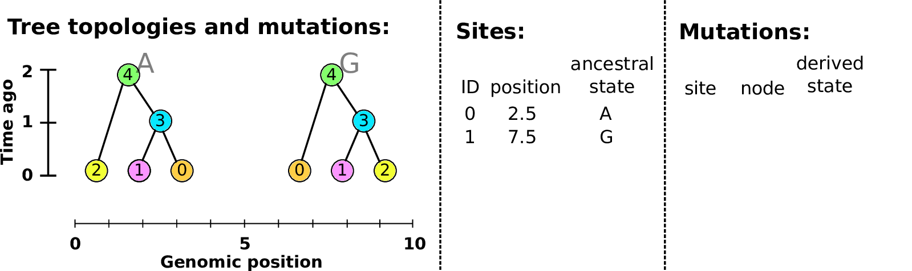
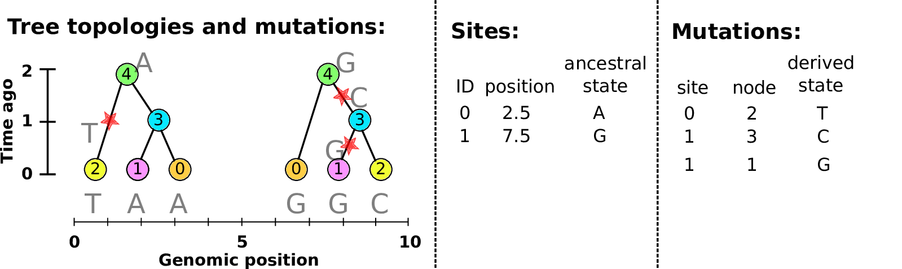
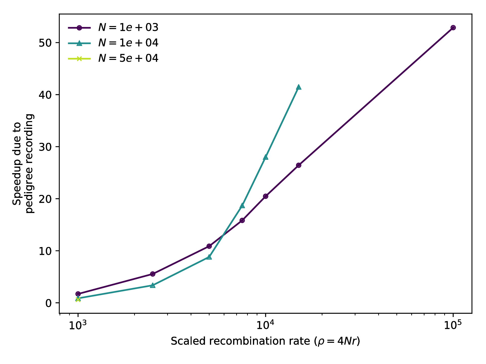

# Overview

##

1. Two problems, about geography and evolution

2. Tree sequences 

    - for more and better simulations

3. Some steps forward

<!-- Tortoise intro -->

# Problem #1

## the Mojave Desert Tortoise

*Gopherus agassizii:*

::: {.centered}
{width=70%}
:::

## the Mojave Desert Tortoise

::: {.centered}
{width=70%}
:::

## the Mojave Desert Tortoise

::: {.centered}
{width=70%}
:::

## the Mojave Desert Tortoise

::: {.centered}
{width=70%}
:::

## The question(s)

::: {.columns}
::::::: {.column width="50%"}

1. How will changes to the landscape affect population viability and gene flow?

2. How do tortoises move around on the landscape?

:::
::::::: {.column width="50%"}

:::
:::::::

<!-- Mimulus intro -->

# Problem #2

## Genomic landscapes

##

What causes variation in genetic diversity?

##

$$
\begin{aligned}
\pi &= \text{ (within-pop diversity) } \\
d_{xy} &= \text{ (between-pop divergence) } \\
F_{ST} &= \text{ (relative differentiation) }
\end{aligned}
$$

::: {.centered}

{width=60%}

:::

## Diversity correlates with recombination rate

Corbett-Detig et al 2015; Cutter & Payseur 2013 

--------------------

{width=70%}

Corbett-Detig et al 2015

<!--

-------------------

-------------------

McVicker et al 2009
-->

--------------

linked selection

: The indirect effects of selection on genomic locations
  that are *linked* to the sites under selection by a lack of recombination.

::: {.centered}

{.fragment width="40%"}
{.fragment width="40%"}

:::

The *Mimulus aurantiacus* species complex
-----------------------------------------

::: {.centered}

:::

<!--

------------------

::: {.centered}
{width=70%}
:::

-->

----------------------------------

----------------------------------

-------------------------

The data:

- chromosome-level genome assembly
- $20\times$ coverage of 8 taxa and outgroup (*M.clevelandii*)
- diversity ($\pi$), divergence ($d_{xy}$),
    and differentiation ($F_{ST}$) in windows
- 36 pairwise comparisons among 9 taxa
- estimates of recombination rate and gene density
    from map and annotation

<!--
## A spectrum of differentiation

-->

-------------------

---------------------

::: {.centered}
{width=60%}
:::

## 

- Emergence of landscape of diversity across $\approx$ 1.5 million years!

- Shared targets of linked selection across taxa?

. . .

- But, what *kind* of linked selection? \
    How strongly and frequently does it act? \
    On how many targets?

. . .

Consequences for: genetic load/disease,
speed of evolution,
trait architecture.

<!-- section SIMULATION -->

# Simulation: not as easy as you might think

## Simulations, to

> - make predictions
> 
> - guide theory
> 
> - train inference methods

-----------------------------

We need:

- large populations with long genomes
- many loci under selection
- geographic population structure

for long enough to reach equilibrium ($\sim 10N$ generations).

. . .

For instance: $10^4$ individuals with $2 \times 10^8$ base pairs each for $10^5$ generations;
nonneutral mutations possible at $10^5$ loci.

##

*First:*

- **large populations with long genomes**

<!-- 1. explain tree sequences and why they are so efficient (5min) -->

# The tree sequence

---------------

---------------

## History is a sequence of trees

For a set of sampled chromosomes,
at each position along the genome there is a genealogical tree
that says how they are related.

. . .

----------------------

A **tree sequence** describes this, er, sequence of trees.

<!--
. . .

*Observations:*

1. The *pedigree* (parental relationships) plus crossover locations
    would give us the tree sequence for *everyone, ever*.

2. Much less can fully describe the history relevant to a *sample* of genomes.

3. This information is equivalent to the Ancestral Recombination Graph (ARG).
-->

-------------

[Kelleher, Etheridge, and McVean](http://journals.plos.org/ploscompbiol/article?id=10.1371/journal.pcbi.1004842) 
introduced the **tree sequence** data structure
for a fast coalescent simulator, [msprime](https://github.com/jeromekelleher/msprime).

- stores sequence *and* genealogical data

- tree differences allow **very** efficient

    * subsetting
    * calculation of allele frequencies in arbitrary cohorts
    * linkage disequilibrium
    * log-time haplotype matching

- tree-based sequence storage closely related to haplotype-matching compression

## Simulated file sizes

::: {.centered}
{width=90%}
:::

from *Kelleher et al 2018, *Inferring the ancestry of everyone"*

<!-- Estimated sizes of files required to store the genetic variation data for a
simulated human-like chromosome (100 megabases) for up to 10 billion haploid
(5 billion diploid) samples. Simulations were run for 10 1 up to 10 7 haplotypes
using msprime [Kelleher et al., 2016], and the sizes of the resulting files plotted
(points). -->

## Example: three samples; two trees; two variant sites

-----------------------

Storing a tree sequence in
the four tables - *nodes*, *edges*, *sites*, and *mutations* -
is *succinct* (no redundancy).

. . .

These are stored efficiently on disk
with a bit more information (e.g., metadata).

## Nodes and edges

Edges 

:   Who inherits from who; only *necessary* for coalescent events.

    Records: interval (left, right); parent node; child node.

Nodes 

:   The ancestors those happen in.

    Records: time ago (of birth); ID (implicit).

-------------------

-------------------

-------------------

-------------------

-------------------

-------------------

-------------------

## Sites and mutations

Mutations

:   When state changes along the tree.

    Records: site it occured at; node it occurred in; derived state.

Sites 

:   Where mutations fall on the genome.

    Records: genomic position; ancestral (root) state; ID (implicit).

------------------

------------------

------------------

------------------

------------------

<!-- 4. explain application to fwds sim recording (5min) -->

# Forwards-time tree sequence recording

## The main idea

If we *record the tree sequence*
that relates everyone to everyone else,

after the simulation is over we can put neutral mutations down on the trees.

. . .

Since neutral mutations don't affect demography,

this is *equivalent* to having kept track of them throughout.

------------

This means recording the entire genetic history of **everyone** in the population, **ever**.

.  . .

It is *not* clear this is a good idea.

## Tree recording strategy

Every time an individual is born, we must:

::: incremental

1. add each contributing gamete to the Node Table,
2. add entries to the Edge Table
    recording which parental copy each inherited each bit of genome from, and
3. add any new selected mutations to the Mutation Table 
    and (if necessary) their locations to the Site Table.

:::

. . .

::: {.columns}
:::::: {.column width=15%}

{width="100%"}

:::
:::::: {.column width=5%}

:::
:::::: {.column width=75%}

This produces **waaaaay** too much data.

:::
::::::

-------------------

We won't end up needing the *entire* history
of *everyone ever*,

. . .

but we won't know *what* we'll need until later.

. . .

How do we get rid of the extra stuff?

## Simplification

*Question:* given a tree sequence
containing the history of many individuals,
how do we *simplify* it to only the history
of a subset?

-----------

Concretely, given an input tree sequence
and a subset of its nodes we call the *samples*,

we want a new *minimal* tree sequence
that contains the history of those samples.

<!--
1. All marginal trees match the corresponding subtree 
    in the input tree sequence.

2. Every non-sample node in marginal trees has at least two children.

3. All nodes and edges are ancestral to at least one sample.

4. No adjacent redundant edges 
    (e.g., $(\ell, x, p, c) + (x, r, p, c) \rightarrow (\ell, r, p, c)$).
-->

-----------

To simplify a tree sequence
to the history of the *samples*:

> 1. Paint each *sampled* chromosome a distinct color.
> 
> 2. Moving back up the tree sequence,
>     copy colors of each chromosome to the parental chromosomes
>     they inherited from.
> 
> 3. If two colors go in the same spot (*coalescence*),
>     replace with a new color (unique to that ancestor).
>     Output a node for the ancestor and an edge for the coalescence.
> 
> 4. Once all colors have coalesced in a given segment,
>     stop propagating it.

## An example: simplify these to J and K

{ width="100%" }

-------------------

{ width="100%" }

-------------------

{ width="100%" }

-------------------

{ width="100%" }

-------------------

{ width="100%" }

-------------------

{ width="100%" }

-------------------

{ width="100%" }

-------------------

{ width="100%" }

-------------------

{ width="100%" }

-------------------

{ width="100%" }

-------------------

{ width="100%" }

-------------------

{ width="100%" }

-------------------

{ width="100%" }

-------------------

{ width="100%" }

-------------------

{ width="100%" }

-------------------

{ width="100%" }

-------------------

{ width="100%" }

## Wright-Fisher, N=10: before simplification

## Wright-Fisher, N=10: before simplification

## ... and after simplification

## *Revised* tree recording strategy

Every time an individual is born, we must:

1. add each gamete to the Node Table,
2. add entries to the Edge Table
    recording which parent each gamete inherited each bit of genome from
3. add any new mutations to the Mutation Table 
    and (if necessary) their locations to the Site Table.

... and,

4. Every so often, *simplify* the tables so far,
    retaining the history of the current generation.

# Implementation and results

## Benchmark implementation

- Recording, simplifying, and output of tables: 
    `C` code in `msprime`.

- Simulation: [`fwdpp`](https://github.com/molpopgen/fwdpp), by Kevin Thornton (in `C++`) ([code](https://github.com/molpopgen/fwdpy11_arg_example))

- Glue: [`pybind11`](https://github.com/pybind/pybind11/) and [`numpy`](http://www.numpy.org/)

- Machine: Ubuntu / 2x 2.6 GHz Intel E5-2650 CPU

## Simulation parameters

- Wright-Fisher population of size $N$

- simulated for $10N$ generations

- neutral mutation rate $\mu$ equal to recombination rate $r$ per gamete

- many, weakly deleterious mutations: rate $\mu/100$ with
    $s$ exponentially distributed with mean $2.5/N$.

. . .

*Note:*
if we recorded tree sequences ("pedigree recording")
then the neutral mutation rate was *zero*
but neutral mutations were added *afterwards*.

--------------------------

<!--
Translation:
$$
\begin{aligned}
N=10^3 \text{ and } \rho=10^4 \\
\Rightarrow L \approx 2.5 \times 10^8 \text{bp}
\end{aligned}
$$

$$
\begin{aligned}
N=10^4 \text{ and } \rho=10^4 \\
\Rightarrow L \approx 2.5 \times 10^7 \text{bp}
\end{aligned}
$$

$$
\begin{aligned}
N=5 \times 10^4 \text{ and } \\
\qquad \rho=10^5 \\
\Rightarrow L \approx 5 \times 10^7 \text{bp}
\end{aligned}
$$
-->

{ width=80% }

--------------------------

{ width=80% }

# Geographic simulations

----------------

To check predictions, we **still** need simulations with:

- many loci under selection
- **geographic population structure**
- large populations with long genomes

for long enough to reach equilibrium ($\sim 10N$ generations).

. . .

::: {.columns}
:::::: {.column width=15%}

{width="100%"}

:::
:::::: {.column width=5%}

:::
:::::: {.column width=75%}

SLiM v3.1 *(Haller and Messer)*

:::
::::::

## 

::: {.columns}
::::::: {.column width="50%"}

**S**election on **Li**nked **M**utations, v3.1:
a forwards-time, individual-based, explicitly genomic simulator,
now with:

- continuous space
- geographic maps
- locally, density-dependent demography (*non-Wright-Fisher*)

:::
::::::: {.column width="50%"}

<!--  -->

:::
:::::::

. . .

**And a GUI!!!**

## ... now with tree sequence recording!

## A 100x speedup:

::: {.centered}
{width=60%}
:::

## What else can you do with the tree sequence?

> - record ancient samples 
> - true ancestry reconstruction 
> - *recapitation*: fast, post-hoc initialization with coalescent simulation 

---------------------

**For example:**

- genome as human chr7 ($1.54 \times 10^8$bp)
- $\approx$ 10,000 diploids
- 500,000 overlapping generations
- continuous, square habitat
- selected mutations at rate $10^{-10}$
- neutral mutations added afterwards

*Runtime:* 8 hours

# Genomic landscapes

----------------------------------

----------------------------------

## The data

## The data

## Simulations

::: {.columns}
::::::: {.column width="70%"}

- $N=10,000$ diploids
- burn-in for $10N$ generations
- population split followed by period sampling, with:
    
    * neutral
    * background selection
    * selection against introgressed alleles

:::
::::::: {.column width="30%"}

:::
:::::::

------------------

------------------

<!-- Spaaaace results -->

# Spatial landscapes

## Questions

1. How does (continuous) space affect which population genetics signals?

2. Does it depend on **sampling scheme**?

3. 
